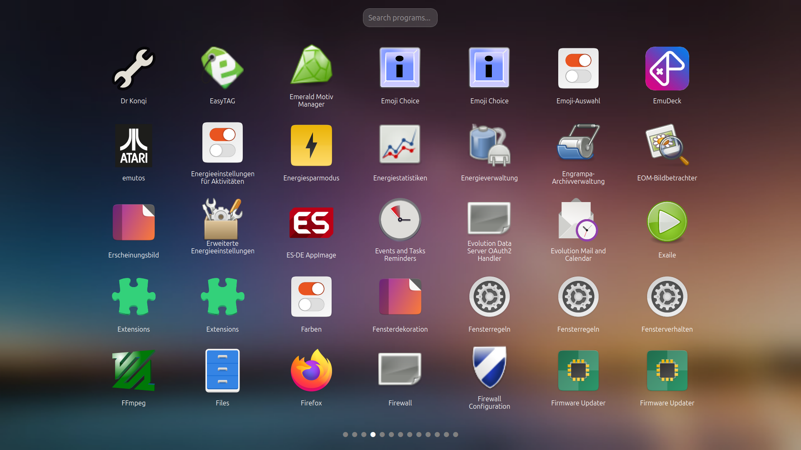
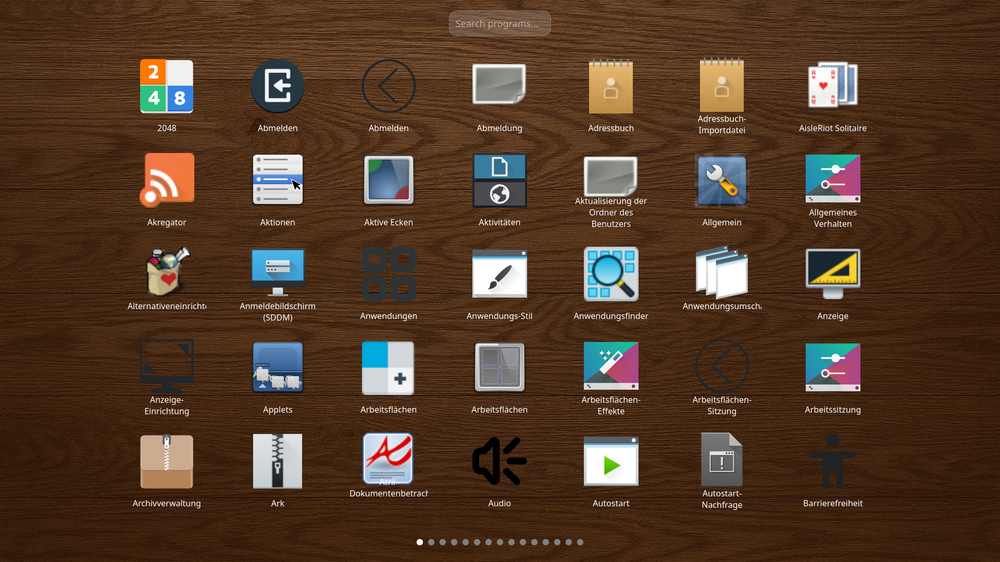
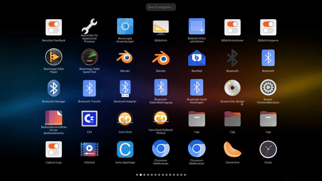
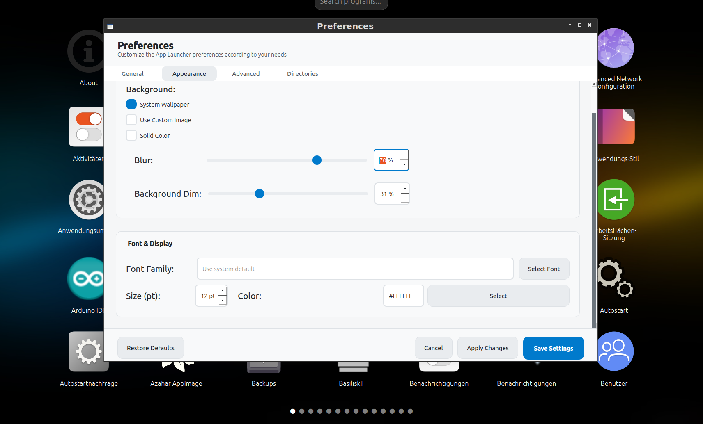

# VIfA-Launcher (Visual Interface for Applications)

VIfA-Launcher is a graphical launcher for applications on Linux,
written in Python using Qt.

## Screenshots

### Main launcher view




## Animated demos

### “Slide” transition


### Search field usage


### “Monte-Trick” transition



### Settings dialog




## Features

- Launch applications through a modern graphical interface
- Integration with the desktop background (wallpaper sync)
- Animated transitions between views
- Configurable settings (font size, colors, directories, etc.)

## Project and package names

- Project/Repository: **VIfA-Launcher**
- Python package: `vifa_launcher`
- Console entry points (see `pyproject.toml`):
  - `vifa-launcher` – starts the main launcher UI
  - `vifa-launcher-settings` – opens the settings dialog

## Installation (from source)

### Requirements

- Python 3.10 or newer
- Python dependencies (installed via `pip`):
  - PyQt5
  - numpy
  - Pillow (PIL)
  - cairosvg

### Steps

```bash
git clone https://github.com/tasteron/VIfA-Launcher.git
cd VIfA-Launcher
python -m venv .venv
source .venv/bin/activate  # on Linux
pip install --upgrade pip
pip install .

